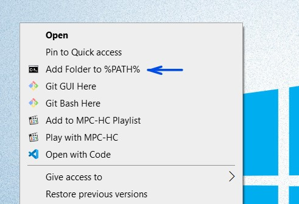

# directory_to_PATH
easily add any folder path to your user's __PATH__ envrionment variable on the Windows Operating System (Tested and working on Windows 10).

Using a simple PowerShell command, you'll be able to able to easily append a directory full path to the PATH environment variable of the current user.

To activite this function, simply execute the __*add_shortcut.reg*__ file and an entry marked __*"Add folder to %PATH%"*__ will be added in the context menu of any folder (Conext menu appear when right-clicking on an object).

When selecting the corresponding entry, the full path of the fodler should be added to the __PATH__ environment variable. To verify the command execution, please open a command prompt and run the following command: `echo %PATH%`.

__Note__ that a PowerShell window may appear for a brief moment during execution.

To delete the entry from the context menu, execute the __*delete_shortcut.reg*__ file.
